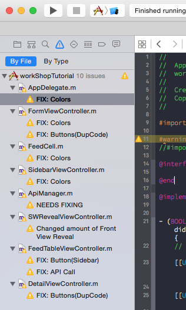

# UH iOS Workshop 

## Prerequisites

Make sure you have installed all of the following prerequisites on your development machine:

- Xcode - [Download & Install Xcode 7](https://developer.apple.com/xcode/download/).
- Git - [Download & Install Git](https://git-scm.com/downloads)
- CocoaPods - [CocoaPods](https://cocoapods.org/) is the dependency manager for Swift and Objective-C Cocoa projects. 

To install CocoaPods, you must have `Homebrew` installed on your Mac. Open the Terminal and run the following command: 

```bash
$ ruby -e "$(curl -fsSL https://raw.githubusercontent.com/Homebrew/install/master/install)"
```
Once `Homebrew` has installed, you will need to install CocoaPods with the following command:

```bash
$ sudo gem install cocoapods
```

### Cloning The GitHub Repository
The recommended way to get workshopTutorial is to use git to directly clone the workshopTutorial repository **and start off at Chapter 1**:

```bash
$ git clone https://github.com/fbuentello/workshopTutorial.git -b startChapter1
```

Don't forget to `cd` into the directory:

```bash
cd workshopTutorial/
```

## Quick Install
Once you've cloned workshopTutorial and installed all the prerequisites, you're just a few steps away from getting starting.

The first thing you should do is install the Pod dependencies. The repo comes with a `Podfile` that contains the list of dependencies you need to start your application. 

To install the Pod dependencies, open up a Terminal in the application folder run this in the command-line:

```bash
$ pod install
```
This may take a minute, but once complete, you should have a few new files in your directory. Be sure to close out any Xcode sessions as it should say on the terminal:

``` bash
"[!] Please close any current Xcode sessions and use `workShopTutorial.xcworkspace` for this project from now on."
```
Next open up the `workShopTutorial.xcworkspace` in Xcode, and Let's get started.

##Chapter 1

With the project open, **Run/Build** the tutorial on the simulator. Everything works fine, but as you see, we're getting some warnings. Don't worry, I put those warning there.



We'll be fixing the **FIX:Colors** warning in Chapter 1.

### FIX:Colors

Example:
```objective-c
fullName.textColor = [UIColor colorWithRed:85.0/255.0 green:172.0/255.0 blue:238.0/255.0 alpha:1.0]; 
```

I found this to be a bad practice in the case that you want to update the color scheme across your entire app. You'll find yourself doing this alot when first developing the app. In storyboard, you can set the `backgroundColor` of a `UIView` to help you visually, just be sure to **set the `backgroundColor` in the Controller**.

#### Colors Solution

The solution was inspired from my time doing web development, in particular, using CSS frameworks like [SASS](http://sass-lang.com/) or [LESS](http://lesscss.org/)(You don't have to read up on them). Using those frameworks, I learned about setting **`Color variables`**. So if I wanted to change my `mainColor`/`baseColor`, all I had to do is change the color at one location, and it would update across my entire app. This definitely helps with consistency. If you want to learn more about color schemes and palettes, checkout [tuts+ Color Theory article](http://webdesign.tutsplus.com/articles/an-introduction-to-color-theory-for-web-designers--webdesign-1437).

I'm going to save us both some time 
**FIX:Button** -

