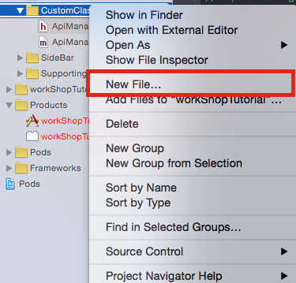
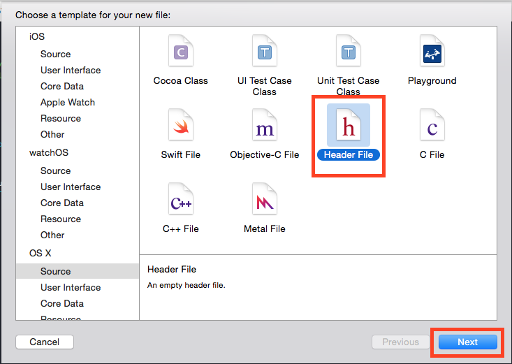
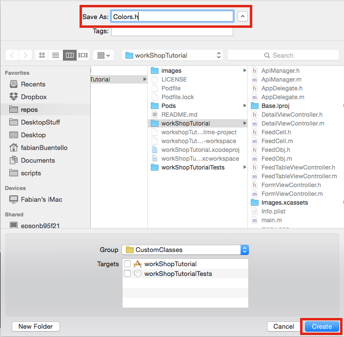
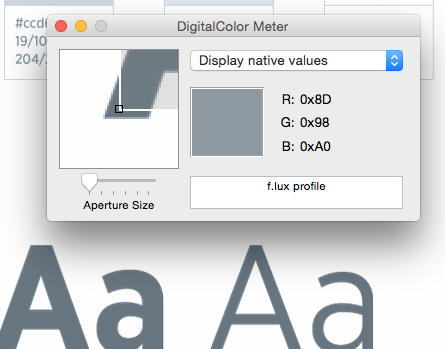
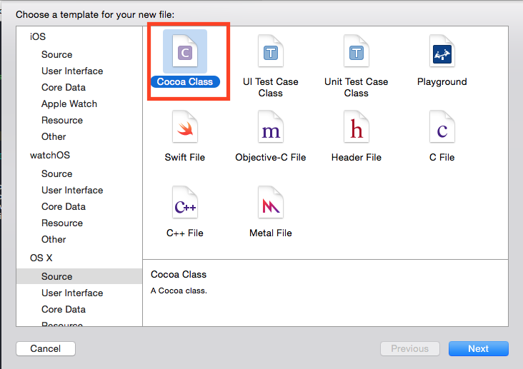
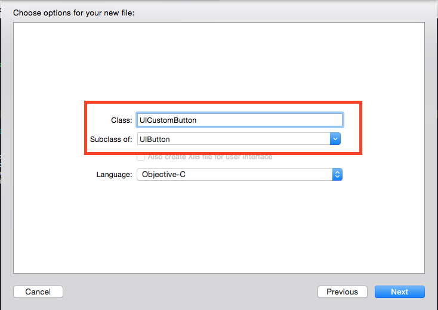
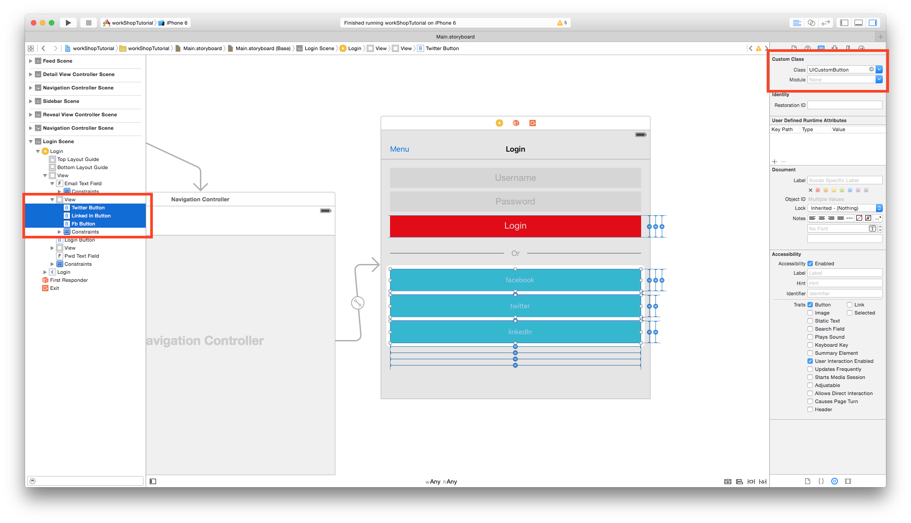
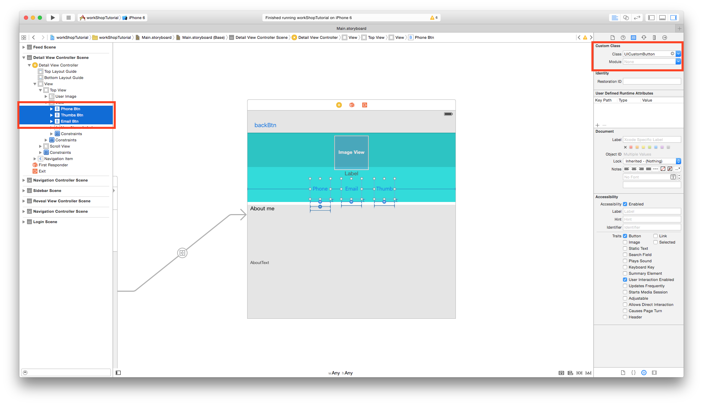
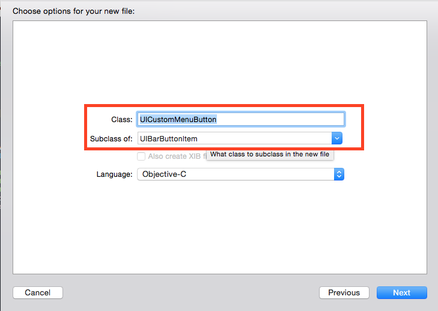
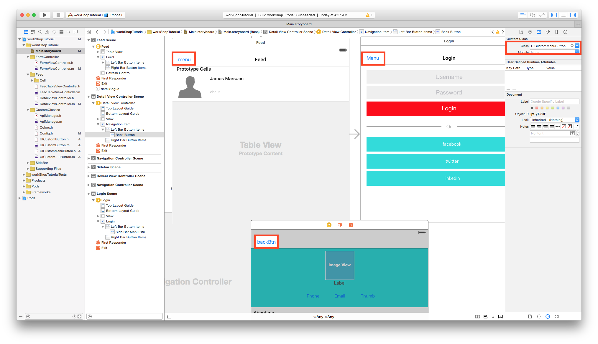

# UH iOS Workshop
### Table of Contents

- [Prerequisites](#prerequisites)
 - [Cloning The Github Repository](#cloning-the-github-repository)
- [Quick Install](#quick-install)
- [Tutorial](#tutorial)
 - [Chapter 1: Color Scheme](#chapter-1)
 - [Chapter 2: Custom Buttons](#chapter-2)
 - [Chapter 3: Networking(API)](#chapter-3)
 
 
##<a name="prerequisites"></a> Prerequisites

Make sure you have installed all of the following prerequisites on your development machine:

- Xcode - [Download & Install Xcode 7](https://developer.apple.com/xcode/download/).
- Git - [Download & Install Git](https://git-scm.com/downloads)
- CocoaPods - [CocoaPods](https://cocoapods.org/) is the dependency manager for Swift and Objective-C Cocoa projects.

To install CocoaPods, you must have `Homebrew` installed on your Mac. Open the Terminal and run the following command:

```bash
$ ruby -e "$(curl -fsSL https://raw.githubusercontent.com/Homebrew/install/master/install)"
```
Once `Homebrew` has installed, you will need to install CocoaPods with the following command:

```bash
$ sudo gem install cocoapods
```

###<a name="cloning-the-github-repository"></a> Cloning The GitHub Repository
The recommended way to get **workshopTutorial** is to use git to directly clone the workshopTutorial repository **and start off at Chapter 1**:

```bash
$ git clone https://github.com/fbuentello/workshopTutorial.git -b startChapter1
```

Don't forget to `cd` into the directory:

```bash
cd workshopTutorial/
```

##<a name="quick-install"></a> Quick Install
Once you've cloned **workshopTutorial** and installed all the prerequisites, you're just a few steps away from getting starting.

The first thing you should do is install the Pod dependencies. The repo comes with a `Podfile` that contains the list of dependencies you need to start your application.

To install the Pod dependencies, open up a Terminal in the application folder and run this in the command-line:

```bash
$ pod install
```
This may take a minute, but once complete, you should have a few new files in your directory. Be sure to close out any Xcode sessions as it should say on the terminal:

``` bash
"[!] Please close any current Xcode sessions and use `workShopTutorial.xcworkspace` for this project from now on."
```
Next open up the `workShopTutorial.xcworkspace` in Xcode, and Let's get started.

-
#<a name="chapter-1"></a>Chapter 1

Be sure to have check out `Chapter1` so you can start off at the beginning of the tutorial. Here's the command:

```bash
$ git checkout Chapter1
```

With the project open, **Run/Build** the tutorial on the simulator. Everything works fine, but as you see, we're getting some warnings. Don't worry, I put those warning there.


We'll be fixing the **FIX:Colors** warning in Chapter 1.

### FIX:Colors

Example:
```objective-c
fullName.textColor = [UIColor colorWithRed:85.0/255.0 green:172.0/255.0 blue:238.0/255.0 alpha:1.0];
```

I found this to be a bad practice in the case that you want to update the color scheme across your entire app or even trying to remember what color this even is. You'll find yourself doing this a lot when first developing the app. In storyboard, you can set the `backgroundColor` of a `UIView` to help you visually, just be sure to **set the `backgroundColor` in the Controller**.

#### Colors Solution

The solution was inspired from my time doing web development, in particular, using CSS frameworks like [SASS](http://sass-lang.com/) or [LESS](http://lesscss.org/)(You don't have to read up on them). Using those frameworks, I learned about setting **`Color variables`**. So if I wanted to change my `mainColor`/`baseColor`, all I had to do is change the color at one location, and it would update across my entire app. This definitely helps with consistency. If you want to learn more about color schemes and palettes, check out [tuts+ Color Theory article](http://webdesign.tutsplus.com/articles/an-introduction-to-color-theory-for-web-designers--webdesign-1437).

I'm going to save us both some time and tell you that we are going to create 2 new header files, **`Colors.h`** and **`Config.h`**. `Config.h` will be explained a bit later on in the tutorial, but perform the following steps on your project.

===========

###Step 1

**Select New file**



**Select Header file**



**Create New file**



In the end, you should have two new files(**`Colors.h`**, **`Config.h`**) in your `CustomClasses` group.

Open up `Config.h` and import `Colors.h`, your file should look like so:

```objective-c
//
//  Config.h
//  workShopTutorial
//
//  Created by Fabian Buentello on 9/28/15.
//  Copyright © 2015 Fabian Buentello. All rights reserved.
//

#ifndef Config_h
#define Config_h

#import "Colors.h"

#endif /* Config_h */
```

### Step 2

Go back to your warnings section.


In each file that has the **`FIX:Colors`** warning, uncomment the line where we import `Config.h`.

```objective-c
#import "config.h"
```

Next we need to set our color variables in our `Colors.h`, I took the liberty to go ahead and do that for you. We will also be using a very popular macro, `UIColorFromRGB`. It uses hexadecimal instead of RGB which I personally find much easier to remember. With that being said, your `Colors.h` should look like this:

```objective-c
//
//  Colors.h
//  workShopTutorial
//
//  Created by Fabian Buentello on 9/28/15.
//  Copyright © 2015 Fabian Buentello. All rights reserved.
//

#ifndef Colors_h
#define Colors_h

#define UIColorFromRGB(rgbValue) [UIColor colorWithRed:((float)((rgbValue & 0xFF0000) >> 16))/255.0 green:((float)((rgbValue & 0xFF00) >> 8))/255.0 blue:((float)(rgbValue & 0xFF))/255.0 alpha:1.0]    //hex converter


#define baseColor UIColorFromRGB(0x81d4dc)

#define baseComplementColor UIColorFromRGB(0x46898F)

#define subColor UIColorFromRGB(0xf04943)

#define sideBarBackground UIColorFromRGB(0x3f3f3f)

//Colors
#define whiteColor UIColorFromRGB(0xffffff)

//TWITTER COLORS link: https://about.twitter.com/company/brand-assets
#define twitterColor UIColorFromRGB(0x55acee)
#define twitterDark UIColorFromRGB(0x292f33)
#define twitterGrey UIColorFromRGB(0x66757f)
#define twitterLightGrey UIColorFromRGB(0xccd6dd)

//FACEBOOK COLORS
#define facebookColor UIColorFromRGB(0x3b5998)

//LINKEDIN COLORS
#define linkedInColor UIColorFromRGB(0x0173b2)

#endif /* Colors_h */
```

As you see, I'm using the [Twitter's color palette](https://about.twitter.com/company/brand-assets). We will be using their colors in our feed, I mean, why not? They do it better than anybody else.

Also, I wanted to mention a few tools that help me when it comes to colors, [colorrrs](http://hex.colorrrs.com/) is a **great**, **simple**, and **fast** way to convert hex to RGB or vice-versa. Another great tool is, [Adobe's color wheel](https://color.adobe.com/create/color-wheel/), it helps create palettes extremely fast. Lastly, I use a tool called, **DigitalColor Meter** which should come native on your mac. It is very helpful to find out the values of colors.

**DigitalColor Meter**



### Step 3

Now we are going to replace all the `[UIColor]` throughout our app. We're going to start with `FormViewController.m`, be sure to **uncomment the `#import "Config.h"` line at the top** of each file. Change your `viewDidLoad` method to look like this:

#### FormViewController.m
```objective-c
- (void)viewDidLoad {
    [super viewDidLoad];
    // Do any additional setup after loading the view.
    _emailTextField.delegate = self;
    _pwdTextField.delegate = self;
    NSDictionary *attributes = @{
                                 NSForegroundColorAttributeName: subColor,
                                 NSFontAttributeName: [UIFont fontWithName:kFontAwesomeFamilyName size:20.0f]
                                 };

    [_sideBarMenuBtn setTitleTextAttributes:attributes forState:UIControlStateNormal];
    _sideBarMenuBtn.title = [NSString fontAwesomeIconStringForEnum:FABars];
    [_sideBarMenuBtn setAction:@selector(revealToggle:)];
    [[self navigationItem] setBackBarButtonItem:_sideBarMenuBtn];

    self.navigationController.navigationBar.barTintColor = baseColor;

    [_loginButton setBackgroundColor: subColor];

    _fbButton.titleLabel.font = [UIFont fontWithName:kFontAwesomeFamilyName size:20];
    [_fbButton setTitle:[NSString stringWithFormat:@"%@  %@",[NSString fontAwesomeIconStringForEnum:FAFacebook],@"Connect with Facebook"] forState:UIControlStateNormal];
    [_fbButton setTitleColor: whiteColor forState:UIControlStateHighlighted];
    [_fbButton setBackgroundColor:facebookColor];

    _twitterButton.titleLabel.font = [UIFont fontWithName:kFontAwesomeFamilyName size:20];
    [_twitterButton setTitle:[NSString stringWithFormat:@"%@  %@",[NSString fontAwesomeIconStringForEnum:FATwitter],@"Connect with Twitter"] forState:UIControlStateNormal];
    [_twitterButton setTitleColor:whiteColor forState:UIControlStateHighlighted];
    [_twitterButton setBackgroundColor:twitterColor];

    _linkedInButton.titleLabel.font = [UIFont fontWithName:kFontAwesomeFamilyName size:20];
    [_linkedInButton setTitle:[NSString stringWithFormat:@"%@  %@",[NSString fontAwesomeIconStringForEnum:FALinkedin],@"Connect with LinkedIn"] forState:UIControlStateNormal];
    [_linkedInButton setTitleColor:whiteColor forState:UIControlStateHighlighted];
    [_linkedInButton setBackgroundColor:linkedInColor];
}

```

All this button code is really making everything messy, don't worry, we'll get to that in the next chapter. Go ahead and remove the `#warning FIX:Colors` at the top of the file.

Next we are going to the `viewDidLoad` method inside of
`FeedTableViewController`. No need to paste the entire method inside, I'm only going to paste the parts we are going to update.

#### FeedTableViewController.m

```objective-c

- (void)viewDidLoad {
   NSDictionary *attributes = @{
                                 NSForegroundColorAttributeName: subColor,
                                 NSFontAttributeName: [UIFont fontWithName:kFontAwesomeFamilyName size:20.0f]
                                 };
.
.
.

    self.navigationController.navigationBar.barTintColor = baseColor;
}
```

We're going to do the same to the rest of the files that contain the `#warning FIX:Colors`. Be sure to **uncomment the `#import "Config.h"` and remove `#warning FIX:Colors` once updating the file.

#### DetailViewController

```objective-c
- (void)viewDidLoad {
    [super viewDidLoad];
    NSDictionary *attributes = @{
                                 NSForegroundColorAttributeName: subColor,
                                 NSFontAttributeName: [UIFont fontWithName:kFontAwesomeFamilyName size:20.0f]
                                 };

    ......

    _phoneBtn.tintColor = whiteColor;
    _phoneBtn.backgroundColor = baseComplementColor;

    ......

    _emailBtn.tintColor = whiteColor;
    _emailBtn.backgroundColor = baseComplementColor;

    ......

    _thumbsBtn.tintColor = whiteColor;
    _thumbsBtn.backgroundColor = baseComplementColor;

    ......

    _userImage.layer.borderColor = [subColor CGColor];

    ......
}
```

#### AppDelegate.m

```objective-c
- (BOOL)application:(UIApplication *)application didFinishLaunchingWithOptions:(NSDictionary *)launchOptions {
    // Override point for customization after application launch.
    [[UINavigationBar appearance] setTitleTextAttributes:@{NSForegroundColorAttributeName: whiteColor}];

    ...

    [[UINavigationBar appearance] setBackgroundColor: baseColor];
    return YES;
}

```


#### SidebarViewController.m
```objective-c
- (void)viewDidLoad
{
    [super viewDidLoad];
    self.tableView.backgroundColor = sideBarBackground;
    menuItems = @[@"feed",@"form"];
}

...

- (UITableViewCell *)tableView:(UITableView *)tableView cellForRowAtIndexPath:(NSIndexPath *)indexPath
{
    ...

    cell.textLabel.textColor = subColor;

    ...

    return cell;
}
```

#### FeedCell.m
```objective-c
- (void)awakeFromNib {

    ...

    userImage.layer.borderColor = [subColor CGColor];
    fullName.textColor = twitterColor;
    userName.textColor = twitterGrey;
    aboutText.textColor = twitterDark;
}
```

Alright, go ahead and run the app and everything should still work(Sorry, nothing exciting). If not, it's ok, chapter 2 is right around the corner and you will be able to pull that version of the repo. Before we go on to **Chapter 2**, a lot of our classes are importing the same files, it would be helpful we only had to import one file and all these frameworks would be accessible, don't you say?

Let's return to `Config.h` and update it with the following code, I'll explain afterward:

```objective-c
//
//  Config.h
//  workShopTutorial
//
//  Created by Fabian Buentello on 9/28/15.
//  Copyright © 2015 Fabian Buentello. All rights reserved.
//

#ifndef Config_h
#define Config_h

#import "Colors.h"
#import "NSString+FontAwesome.h"
#import "SWRevealViewController.h"
#import "ApiManager.h"
#import <SDWebImage/UIImageView+WebCache.h>

#endif /* Config_h */

```

Since all these classes do not contain sensitive information, fairly small, and perform one task. It would be convenient to just import them all at once in `Config.h`. Now we will only have to worry about importing one file into our controllers. I would not recommend importing files that are not used multiple times throughout the app in this file.

Now go to the following files and only import `Config.h` if it contains one of the above files.

- FormViewController.m
- FeedTableViewController.m
- DetailViewController.m

Run the app one more time to make sure everything is good. Next up, **Chapter 2**.


#<a name="chapter-2"></a>Chapter 2

In case something went wrong during [ Chapter 1](#chapter-1), you can sync up your repo by running the following command in the Terminal:

```bash
$ git checkout Chapter2 -f
```

For Chapter 2 we need to get rid of all this repetitive button code. First let's actually look at what's being repeated.

Most of the buttons usually include:

- FontAwesome
- Custom Colors

We're going to start off in `viewDidLoad` inside of `FormViewController.m`, more specifically, the social media buttons at the bottom of the method.

If they all had the same attributes, we could throw them in a forloop like the example code below(**DON'T COPY**):

```objective-c
NSArray * blackShadowItems = @[eventName, addressLabel, dateLabel];
for (UIView * view in blackShadowItems) {
    view.layer.masksToBounds = NO;
    view.layer.shadowColor = [UIColor blackColor].CGColor;
    view.layer.shadowOpacity = 0.5;
    view.layer.shadowRadius = 2;
    //(right,down) also (-right,-down)
    view.layer.shadowOffset = CGSizeMake(0.0f, 0.8f);
}
```

But since they have different colored backgrounds and titles, maybe a method would be appropriate?...NAAAHHHHHHH!!! This is the second thing I wish I was told to do more when I first started mobile development. That is, making custom classes for outlets. So let's add a class named `UICustomButton` to our **CustomClasses** group.

Add new file



Name file `UICustomButton` of subclass `UIButton`


==========

Open up `UICustomButton.h` and import `Config.h` and let's add a custom method that will let us configure these buttons in one line of code.

#### UICustomButton.h

```objective-c
//
//  UICustomButton.h
//  workShopTutorial
//
//  Created by Fabian Buentello on 9/29/15.
//  Copyright © 2015 Fabian Buentello. All rights reserved.
//

#import <UIKit/UIKit.h>
#import "Config.h"

@interface UICustomButton : UIButton
-(void)SocialMediaBtnWithIcon:(FAIcon)icon andTitle:(NSString *)title andColor:(id)color;
@end
```

Now switch over to `UICustomButton.m` and let's implement this method. What we are going to do, is bring the code over from `FormViewController.m` and place it in `UICustomButton.m`:

#### UICustomButton.m
```objective-c

//
//  UICustomButton.m
//  workShopTutorial
//
//  Created by Fabian Buentello on 9/29/15.
//  Copyright © 2015 Fabian Buentello. All rights reserved.
//

#import "UICustomButton.h"

@implementation UICustomButton

-(void)awakeFromNib {
    self.tintColor = whiteColor;
    self.titleLabel.font = [UIFont fontWithName:kFontAwesomeFamilyName size:20];
}

-(void)SocialMediaBtnWithIcon:(FAIcon)icon andTitle:(NSString *)title andColor:(id)color {

    self.titleLabel.font = [UIFont fontWithName:kFontAwesomeFamilyName size:20];
    [self setTitle:[NSString stringWithFormat:@"%@  %@",[NSString fontAwesomeIconStringForEnum:icon],title]
          forState:UIControlStateNormal];
    [self setTitleColor:whiteColor forState:UIControlStateHighlighted];
    [self setBackgroundColor:color];

}

@end

```


By default, `awakeFromNib` will run for any outlet that is set to `UICustomButton` in the Storyboard. Oh yea, we need to add `UICustomButton` to `Config.h`. Add the following line inside of `Config.h`:

#### Config.h
```objective-c
#import "UICustomButton.h"
```


Before we set those outlets in `main.Storyboard`, we need to clean up the code inside of our `FormViewController.m`. Also, don't forget to change the Class type for the IBOutlet:

#### FormViewController.m
```objective-c

...

@property (weak, nonatomic) IBOutlet UICustomButton *fbButton;
@property (weak, nonatomic) IBOutlet UICustomButton *twitterButton;
@property (weak, nonatomic) IBOutlet UICustomButton *linkedInButton;

...

- (void)viewDidLoad {
    [super viewDidLoad];

    ...

    [_loginButton setBackgroundColor: subColor];

    [_fbButton SocialMediaBtnWithIcon:FAFacebook andTitle:@"Connect with Facebook" andColor:facebookColor];
    [_twitterButton SocialMediaBtnWithIcon:FATwitter andTitle:@"Connect with Twitter" andColor:twitterColor];
    [_linkedInButton SocialMediaBtnWithIcon:FALinkedin andTitle:@"Connect with LinkedIn" andColor:linkedInColor];
}

```
**Well doesn't that just look clean!**

Lastly, in storyboard, select the social media buttons in the view and update their classes:



Next we are going to move over to `viewDidLoad` inside of our `DetailViewController.m`. It looks like we're repeating code(`_phoneBtn`,`_emailBtn`,`_thumbsBtn`) again. Let's abstract some of this code into a new method inside of our `UICustomButton` class. First let's **declare a new method inside of our `UICustomButton.h`**:

#### UICustomButton.h

```objective-c
-(void)CircleBtnWithIcon:(FAIcon)icon;
```
After, switch over to `UICustomButton.m` so we can implement `CircleBtnWithIcon:`. Again, all we are doing is moving that code away from `DetailViewController.m`. And since `awakeFromNib` already sets the `tintColor` and `titleLabel.font`, we have fewer lines to write:

#### UICustomButton.m ####
```objective-c
-(void)CircleBtnWithIcon:(FAIcon)icon {
    self.clipsToBounds = YES;
    self.layer.cornerRadius = 60.0f/2.0f;
    self.layer.borderColor = self.titleLabel.textColor.CGColor;
    self.backgroundColor = baseComplementColor;
    [self setTitle:[NSString fontAwesomeIconStringForEnum:icon] forState:UIControlStateNormal];
}
```

Before Moving back to `DetailViewController.m`, let's set up the IBOutlets in `Storyboard`.




With that done, open up `DetailViewController.m` and let's get rid of some code:

#### DetailViewController.m ####

```objective-c

...

@property (weak, nonatomic) IBOutlet UICustomButton *phoneBtn;
@property (weak, nonatomic) IBOutlet UICustomButton *emailBtn;
@property (weak, nonatomic) IBOutlet UICustomButton *thumbsBtn;

...

-(void)viewDidLoad {
    ...

    [[self navigationItem] setBackBarButtonItem:backButton];

    [_phoneBtn CircleBtnWithIcon:FAPhone];
    [_emailBtn CircleBtnWithIcon:FAEnvelope];
    [_thumbsBtn CircleBtnWithIcon:FAThumbsUp];


    self.view.backgroundColor = baseColor;

    ...
}
```
Aaaaannnddddd we're done! But I bet you're asking yourself, "But why hasn't Fabian told us to remove the warnings?!" Well..... There's one more type of button we need to fix, and that's the `UIBarButtonItem` on the left-hand side of our `navigationBar`. In some controllers it acts as a trigger for the slide out menu, in other controllers it acts as a back button. We're going to address that now.

Create a new file inside of our `CustomClasses` group, and name it, `UICustomMenuButton`.



Next, Open up `UICustomMenuButton.h` and import `Config.h` add the following method:

```objective-c
...

#import "config.h"

@interface UICustomMenuButton : UIBarButtonItem
-(void)IconAs:(FAIcon)icon withAction:(SEL)selector;
@end

```

Yep... you guessed it, switch over to `UICustomMenuButton.m` so we can implement this bad boy.

#### UICustomMenuButton ####
```objective-c
#import "UICustomMenuButton.h"

@implementation UICustomMenuButton

- (void)awakeFromNib {
    NSDictionary *attributes = @{
                                 NSForegroundColorAttributeName: subColor,
                                 NSFontAttributeName: [UIFont fontWithName:kFontAwesomeFamilyName size:20.0f]
                                 };

    [self setTitleTextAttributes:attributes forState:UIControlStateNormal];

}

-(void)IconAs:(FAIcon)icon withAction:(SEL)selector {
    self.title = [NSString fontAwesomeIconStringForEnum:icon];
    [self setAction:selector];
}
@end
```

With this setup, we can add more menu buttons with different Icons with ease. 

Remember to add `UICustomMenuButton` to our `Config.h`

```objective-c
#import "UICustomMenuButton.h"
```

Open up storyboard so you can set the menu buttons to `UICustomMenuButton`:



Finally, let's go into the following files and update their code:

#### DetailViewController.m

```objective-c
...

@property (weak, nonatomic) IBOutlet UICustomMenuButton *backButton;
...

-(void)viewDidLoad {
    [super viewDidLoad];

    [backButton IconAs:FAChevronLeft withAction:@selector(popViewControllerAnimated:)];

    [[self navigationItem] setBackBarButtonItem:backButton];

    ...
}
```
#### FormViewController.m

```objective-c
...

@property (weak, nonatomic) IBOutlet UICustomMenuButton *sideBarMenuBtn;
...

-(void)viewDidLoad {
    [super viewDidLoad];

    ...
    [_sideBarMenuBtn IconAs:FABars withAction:@selector(revealToggle:)];

    [[self navigationItem] setBackBarButtonItem:_sideBarMenuBtn];

    ...
}
```
#### FeedTableViewController.m

```objective-c
...

@property (weak, nonatomic) IBOutlet UICustomMenuButton *sideBarMenuBtn;
...

-(void)viewDidLoad {
    [super viewDidLoad];

    [_sideBarMenuBtn IconAs:FABars withAction:@selector(revealToggle:)];

    [[self navigationItem] setBackBarButtonItem:_sideBarMenuBtn];

    ...
}
```

Once finishing that, you may then delete the `#warning FIX:Button` warnings. We're officially done with Chapter 2, Now onto Chapter 3, which will be surprisingly fast..... I think.


#<a name="chapter-3"></a>Chapter 3
